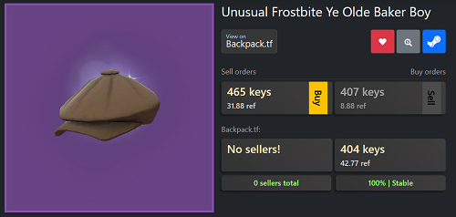
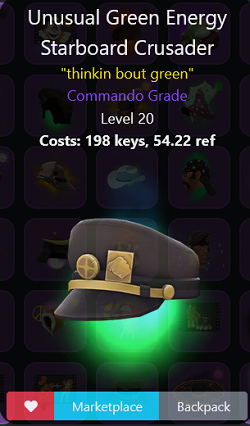
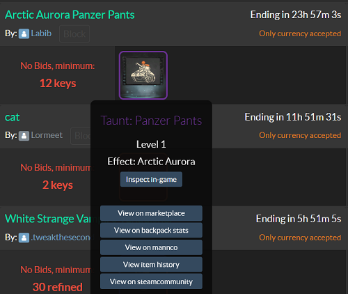
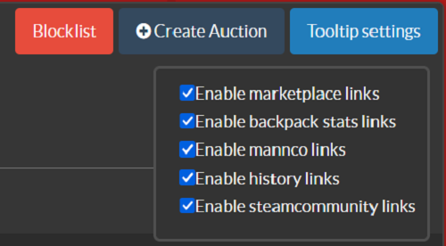
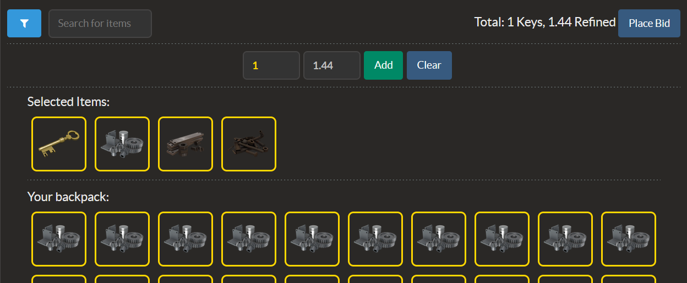

# .TF+ — the collection of TF2 trading sites userscripts
<table>
<tr>
<td>

Quality-of-Life improvements for essential Team Fortress 2 trading websites
  
 
Tech stack:  

  
</td>
</tr>
</table>

  

  <a href="#stn"><b>STN+</b></a> •
  <a href="#scrapauctions"><b>ScrapAuctions+</b></a> •
  <a href="#manncostore"><b>ManncoStore+</b></a> •
  <a href="#quicksellstore"><b>QuicksellStore+</b></a> 

## Requirements
> [!WARNING]  
> You need **Tampermonkey** to be installed.  
> You need to **allow scripts** to make requests

## STN+
Script for [STNTradingEU](https://stntrading.eu/)
 
 

 
> [!IMPORTANT]
> Currently only works with unusuals
### Features: 
* **Item page**: 
  * Cross-platform price aggregation - fetches and displays prices from backpack.tf
  * Buy orders stability checker - checks if buyers are stable at the top buyer price
  * Backpack.tf link for the item
  * Converting marketplace.tf prices to a key&ref price
  * Caching item data for 30 minutes
* **Bot items page**:
  * Backpack.tf link for each item
  * Marketplace.tf link for each item
  * Force schema update feature for keeping the game schema relevant (using autobot.tf)

### Screenshots

  
    

## ScrapAuctions+
Script for [ScrapTF Auctions](https://scrap.tf/auctions)
 
 

 
### Features: 
* **Auctions page**:
  * Blocklist - block users and hide their auctions
  * Tooltip settings - enable or disable links in tooltips
  * Display amount of blocked auctions in header 
* **Certain Auction page**:
  * Automated currency selection - just type values to add and script will add currencies automatically 
* **Both**: Modified default tooltip with
  * Backpack.tf link
  * Marketplace.tf link
  * Mannco.store link
  * Steam Community Market link
  * Item History link
 
### Screenshots

  
    
    

## ManncoStore+
Script for [ManncoStore](https://mannco.store)
 
 

 
> [!IMPORTANT]
> Currently only works within an unusual item page
### Features: 
* Steamcollector link replaced with backpack.tf history link
* Backpack.tf stats button 
## QuicksellStore+
Script for [QuicksellStore](https://quicksell.store/trade)
 
 

 
> [!CAUTION]
> May break due to reactive site behaviour. Use direct `/trade` site path
### Features: 
* Backpack.tf stats page on control + click

## Links
||||
|:--------------------------------------------------------------:|:----------------------------------------------------------:|:----------------------------------------------------------:|
|                     **Github Profile**                       |                      **Steam Profile**                       |                      **Discord Server**                       |

## Contribution & Support

Got some interesting ideas? Or maybe something is wrong? Reach me out on my <a href = "https://discord.gg/jygnfCRjna">discord server</a>

## Sponsor
Feeling like a simple 'Thank you' isn't enough? You can donate via Steam Trade offers 
 
 

## License
This project is licensed under the MIT License - see the [LICENSE](LICENSE) file for details.
